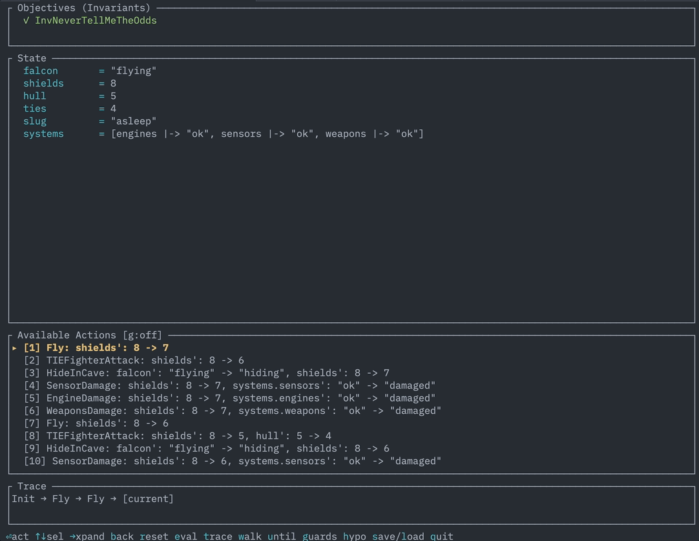

# CLI Guide

Detailed usage for the `tla` command-line tool. See the [README](README.md) for installation, a quick start, and the full options table.

## Configuration Files

tla-rs supports TLC-compatible `.cfg` files. If `Spec.cfg` exists next to `Spec.tla`, it is loaded automatically. Use `--config PATH` to specify an explicit path.

```
CONSTANT RM = {rm1, rm2, rm3}
INIT TPInit
NEXT TPNext
INVARIANT TPTypeOK
CHECK_DEADLOCK TRUE
```

Supported directives: `INIT`/`NEXT`, `SPECIFICATION` (temporal formula in `Init /\ [][Next]_vars` form), `CONSTANT`/`CONSTANTS`, `INVARIANT`/`INVARIANTS`, `PROPERTY`/`PROPERTIES`, `SYMMETRY`, and `CHECK_DEADLOCK`. CLI flags override cfg values.

## Scenarios

Drive the checker along specific execution paths using TLA+ expressions:

```bash
tla spec.tla --scenario "step: count' = count + 1
step: count' = count + 1
step: count' = count + 1"
```

Or load from a file with `--scenario @scenario.txt`. Each `step:` line is a TLA+ predicate over current (unprimed) and next (primed) state variables.

```
step: x' > x                    # x increases
step: "s1" \in active'          # s1 becomes active
step: pc'["p1"] = "critical"    # p1 enters critical section
```

## Demo Walkthroughs

`--present` runs a *demo manifest* — a `.json` or `.toml` file beside the spec that bundles named variants (spec + cfg / constant overrides) and ordered "beats". Each beat runs a scenario or replay against one or more variants and checks assertions, producing a guided, tested walkthrough of how a spec behaves.

```bash
tla --present demo.json                        # guided TUI walkthrough
tla --present demo.json --validate             # non-interactive pass/fail report
tla --present demo.json --export-md out.md      # tested Markdown walkthrough
tla --present demo.json --export-html out.html  # self-contained offline HTML
```

`--export-html` writes a self-contained, offline HTML walkthrough (variant compare, step navigation, change highlighting, inline assertion results).

Adding `--explorable` additionally embeds the wasm engine in the file, turning the walkthrough into a live state explorer — step through enabled actions from any state (number-key hotkeys, actions grouped by name) and see invariant results per state, like a lighter [Interactive Mode](#interactive-mode) in the browser. The explorable export must be built with the `embed-wasm` feature (run `cargo make wasm` first to produce the inlined `pkg/` artifacts):

```bash
cargo make wasm
cargo build --release --features embed-wasm
tla --present demo.json --export-html explorer.html --explorable
```

The engine is base64-inlined and instantiated synchronously, so the file stays fully self-contained and works over `file://`. File-based `INSTANCE` modules aren't available in the browser, so the explorable export works with single-file specs. Prebuilt release binaries are built with `embed-wasm`, so an installed `tla` supports `--explorable` directly.

## Interactive Mode

Launch the TUI with `-i` to step through state spaces manually. You can select and take transitions, backtrack, evaluate expressions in a REPL, trace variable changes across history, test hypotheses against all visited states, and toggle guard condition display. Actions with many variable changes expand inline so you can see exactly what each transition does.



Key bindings: `↑`/`↓` select actions, `Enter` takes the selected action, `→`/`Space` expands grouped changes, `←` collapses, `b` backtracks, `e` opens the REPL, `t` shows variable trace, `h` tests a hypothesis, `g` toggles guards, `w` random walks N steps, `u` steps until a condition holds, `s`/`l` save/load traces, `r` resets to initial state, `q` quits.

```bash
tla examples/c3po_asteroid_field.tla -c 'Density=3' --allow-deadlock -i
```

## Analytics

These flags are for understanding *how* a protocol fails, not just *whether* it fails.

Without `--continue`, the checker stops at the first violation. With it, all violations are collected and counted per-invariant across the full state space:

```bash
tla spec.tla --allow-deadlock --continue
```

`--count-satisfying` measures what fraction of reachable states satisfy a predicate. Add `--verbose` to get per-depth breakdowns showing at which exploration depth violations start appearing:

```bash
tla spec.tla --allow-deadlock --continue \
  --count-satisfying InvSafety --verbose
```

`--sweep` varies a constant across multiple values and produces a comparison table, useful for sensitivity analysis:

```bash
tla spec.tla --sweep 'N=2;3;4;5' --count-satisfying Inv --allow-deadlock
```

`--json` returns structured data including `properties` array with `depth_breakdown` per property.

### The C-3PO Example

C-3PO famously calculates "the possibility of successfully navigating an asteroid field is approximately 3,720 to 1." The spec `examples/c3po_asteroid_field.tla` models the Empire Strikes Back asteroid chase: variable-damage asteroid impacts, TIE fighter attacks, TIEs getting destroyed by asteroids, hiding in the space slug's cave, mynock damage, escaping the exogorth's mouth, and the only real escape — attaching to a Star Destroyer's hull and floating away with the garbage. No hyperspace: the hyperdrive is dead.

The `Density` constant controls asteroid damage range (1..Density). Higher values create more damage variants per action, biasing the state space toward destruction.

```bash
tla examples/c3po_asteroid_field.tla -c 'Density=3' \
  --allow-deadlock --continue \
  --count-satisfying InvNeverTellMeTheOdds \
  --count-satisfying Escaped --verbose
```

The depth breakdown shows destruction starting early and escape requiring a long sequence of correct decisions — surviving asteroids, hiding in the cave, taking mynock damage, escaping the slug, then waiting for all TIE fighters to be destroyed before drifting onto a Star Destroyer's hull.

## Output

On success:
```
Model checking complete. No errors found.

  States explored: 1331
  Transitions: 3630
  Max depth: 31
  Time: 0.019s
```

On invariant violation, you get a counterexample trace with state diffs marking changed variables. On deadlock, a trace to the deadlock state with a suggestion to use `--allow-deadlock`. Parse errors show source locations, and undefined variables suggest similar names.

## State Graph Visualization

```bash
tla spec.tla --export-dot graph.dot
tla spec.tla --export-dot graph.dot --dot-mode full
dot -Tpng graph.dot -o graph.png
```

Four export modes are available via `--dot-mode`:

| Mode | Description |
|------|-------------|
| `clean` (default) | All nodes, no self-loops, parallel edges merged into single labeled edges |
| `full` | All nodes and all edges including self-loops, each edge separate |
| `trace` | Only counterexample trace nodes and edges (falls back to full if no trace) |
| `choices` | Trace path plus alternative transitions at each trace state; non-trace nodes shown dashed, alternative edges gray/dashed (falls back to full if no trace) |

Error states are highlighted in red. Trace edges are red and thick in all modes.
