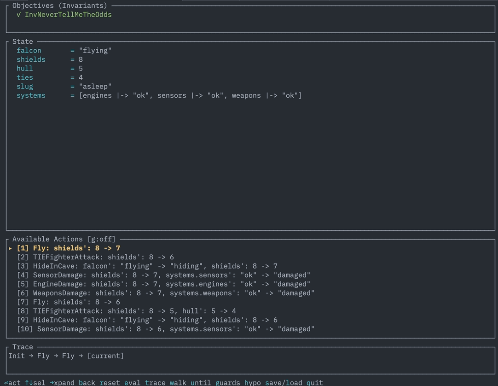

# CLI Guide

Detailed usage for the `tla` command-line tool. See the [README](README.md) for installation and a quick start.

```
tla <spec.tla> [options]
```

## Options

This is the full list printed by `tla --help`.

### Constants and limits

| Option | Description |
|--------|-------------|
| `--constant`, `-c NAME=VALUE` | Set a constant value (formats under [Configuration Files](#configuration-files)) |
| `--symmetry`, `-s NAME` | Enable symmetry reduction for a set constant of model values |
| `--config PATH` | Load a TLC-style cfg file (default: `Spec.cfg` next to `Spec.tla`, if present) |
| `--max-states N` | Maximum states to explore (default: 1000000) |
| `--max-depth N` | Maximum trace depth (default: 100) |
| `--max-powerset N` | Max set size for `SUBSET` enumeration (default: 20) |
| `--max-permutations N` | Max set size for `Permutations` (default: 10) |
| `--max-subbag N` | Max total copies for `SubBag` enumeration (default: 20) |
| `--quick`, `-q` | Quick exploration (limit: 10,000 states) |

### Checking

| Option | Description |
|--------|-------------|
| `--allow-deadlock` | Allow states with no successors |
| `--allow-unassigned-stutter` | Treat a variable an action leaves unassigned as `UNCHANGED` instead of reporting an error |
| `--symbolic-integers` | Treat `Nat`/`Int` as infinite sets (membership only; enumerating them is an error) |
| `--check-liveness` | Check liveness and fairness properties (see [Liveness](#liveness)) |
| `--liveness-engine E` | `tableau` (default) or `legacy` |
| `--check-refinement ALIAS` | Verify `Spec => ALIAS!Spec` for a non-parameterized `INSTANCE` alias |
| `--continue` | Continue past invariant violations (see [Analytics](#analytics)) |
| `--count-satisfying NAME` | Count states satisfying a definition (repeatable) |
| `--sweep NAME=V1;V2;...` | Sweep a constant across values and compare results |
| `--validate` | Parse and validate the spec without model checking |
| `--list-invariants` | Show the detected invariants and exit |

### Exploration

| Option | Description |
|--------|-------------|
| `--scenario TEXT` | Explore a specific scenario (or `@file`; see [Scenarios](#scenarios)) |
| `--interactive`, `-i` | Interactive TUI exploration mode |
| `--replay FILE` | Replay a saved counterexample in the TUI (see [Counterexample Files](#counterexample-files)) |
| `--present FILE` | Run a demo manifest, `.json` or `.toml` (TUI, or `--validate` for a report) |
| `--export-md FILE` | With `--present`: write a Markdown walkthrough |
| `--export-html FILE` | With `--present`: write a self-contained HTML walkthrough |
| `--explorable` | With `--export-html`: embed the wasm engine for in-browser state exploration |

### Output

| Option | Description |
|--------|-------------|
| `--verbose`, `-v` | Verbose output (depth breakdowns, etc.) |
| `-vv` | Debug output |
| `--json` | Output results in JSON format |
| `--export-dot FILE` | Export the state graph to DOT format |
| `--dot-mode MODE` | DOT mode: `full`, `trace`, `clean` (default), `choices` |
| `--trace-json FILE` | Export the counterexample trace to JSON |
| `--save-counterexample FILE` | Export the counterexample with metadata for `--replay` |
| `--version`, `-V` | Show version information |
| `--help`, `-h` | Show help |

## Configuration Files

tla-rs supports TLC-compatible `.cfg` files. If `Spec.cfg` exists next to `Spec.tla`, it is loaded automatically. Use `--config PATH` to specify an explicit path.

```
CONSTANT RM = {rm1, rm2, rm3}
INIT TPInit
NEXT TPNext
INVARIANT TPTypeOK
CHECK_DEADLOCK TRUE
```

Supported directives:

- `INIT`/`NEXT`, or `SPECIFICATION` (temporal formula in `Init /\ [][Next]_vars` form, with exactly one `[][Next]_v` conjunct, as in TLC)
- `CONSTANT`/`CONSTANTS`: `Name = value` assignments, or `Name <- Def` to substitute a zero-parameter definition of the spec
- `INVARIANT`/`INVARIANTS` and `PROPERTY`/`PROPERTIES`
- `SYMMETRY`
- `CHECK_DEADLOCK TRUE|FALSE` (`FALSE` is the same as `--allow-deadlock`)
- `SYMBOLIC_INTEGERS TRUE|FALSE` (same as `--symbolic-integers`)
- `CONSTRAINT`/`CONSTRAINTS`: states outside the constraint are still checked against invariants, as in TLC, but not explored further
- `VIEW`: states with the same view value are treated as one state

`ACTION_CONSTRAINT`, `ALIAS` and `POSTCONDITION` are parsed but ignored with a warning such as `ACTION_CONSTRAINT 'ActC' is not yet supported, ignoring`.

CLI flags override cfg values.

`CONSTANT` values (and `-c` on the CLI) accept integers (`42`), booleans (`TRUE`/`FALSE`), strings (`"hello"`), bare identifiers as model values (`rm1`), sets (`{a, b}`), tuples (`<<1, 2>>`), records (`[hp |-> 100, mp |-> 50]`), and functions built with `:>`/`@@` (`d1 :> 1 @@ d2 :> 2`, left-biased on key collisions). All shapes nest. The set-of-functions form `[S -> T]` is a spec-level expression, not a concrete value, so it is not accepted here.

## Scenarios

Drive the checker along specific execution paths using TLA+ expressions:

```bash
tla spec.tla --scenario "step: count' = count + 1
step: count' = count + 1
step: count' = count + 1"
```

Or load from a file with `--scenario @scenario.txt`. Each line picks the next transition and is one of:

- `step: <expr>`: a TLA+ predicate over current (unprimed) and next (primed) state variables. Constants from the cfg or `-c` resolve inside it.
- `action: <Name>`: the transition produced by the named action.
- `action: <Name>; <expr>`: the named action, further constrained by a predicate.

```
step: x' > x                    # x increases
step: "s1" \in active'          # s1 becomes active
step: pc'["p1"] = "critical"    # p1 enters critical section
action: NTPSync
action: Cadence; tampered' = TRUE
```

`action:` lines remove the need for a synthetic action-tag variable in the spec. The [time-integrity example](examples/time-integrity/WALKTHROUGH.md) uses them throughout.

## Demo Walkthroughs

`--present` runs a *demo manifest* — a `.json` or `.toml` file beside the spec that bundles named variants (spec + cfg / constant overrides) and ordered "beats". Each beat runs a scenario or replay against one or more variants and checks assertions, producing a guided, tested walkthrough of how a spec behaves.

```bash
tla --present demo.json                        # guided TUI walkthrough
tla --present demo.json --validate             # non-interactive pass/fail report
tla --present demo.json --export-md out.md      # tested Markdown walkthrough
tla --present demo.json --export-html out.html  # self-contained offline HTML
```

`--export-html` writes a self-contained, offline HTML walkthrough (variant compare, step navigation, change highlighting, inline assertion results).

Adding `--explorable` additionally embeds the wasm engine in the file, turning the walkthrough into a live state explorer — step through enabled actions from any state (number-key hotkeys, actions grouped by name) and see invariant results per state, like a lighter [Interactive Mode](#interactive-mode) in the browser. A parametric action (one whose `Next` disjunct picks from a domain, e.g. `\E v \in 0..MaxTime : wallClock' = v`) is not rendered as one button per value — its variants are factored into the shared effect (shown once) plus one value picker per variable that differs, with cascading selection when several vary. So a reboot that chooses both an offline duration and a boot-time wall clock becomes two dropdowns, not their cross-product. The explorable export must be built with the `embed-wasm` feature (run `cargo make wasm` first to produce the inlined `pkg/` artifacts):

```bash
cargo make wasm
cargo build --release --features embed-wasm
tla --present demo.json --export-html explorer.html --explorable
```

The engine is base64-inlined and instantiated synchronously, so the file stays fully self-contained and works over `file://`. File-based `INSTANCE` modules aren't available in the browser, so the explorable export works with single-file specs. Prebuilt release binaries are built with `embed-wasm`, so an installed `tla` supports `--explorable` directly.

## Interactive Mode

Launch the TUI with `-i` to step through state spaces manually. You can select and take transitions, backtrack, evaluate expressions in a REPL, trace variable changes across history, test hypotheses against all visited states, and toggle guard condition display. Actions with many variable changes expand inline so you can see exactly what each transition does.



Key bindings: `↑`/`↓` (or `k`/`j`) select actions, `Enter` takes the selected action, `→`/`Space` expands grouped changes, `←` collapses, `b` backtracks, `e` opens the REPL, `t` shows variable trace, `h` tests a hypothesis, `g` toggles guards, `w` random walks N steps, `u` steps until a condition holds, `s`/`l` save/load traces, `r` resets to initial state, `q` quits.

```bash
tla examples/c3po_asteroid_field.tla -c 'Density=3' --allow-deadlock -i
```

## Liveness

A cfg `PROPERTY` (or `--check-liveness`) turns on temporal checking. Fairness comes from the `WF_vars`/`SF_vars` conjuncts of the cfg `SPECIFICATION`, including quantified ones (`\A p \in P : WF_vars(Enter(p))`).

```
SPECIFICATION Spec
PROPERTY Progress
```

Each `PROPERTY` is split into the parts TLC checks separately:

| Conjunct | Checked as | Failure |
|----------|------------|---------|
| state predicate `P` | on every initial state | property violation (kind `init`) |
| `[]P` | an invariant, named after the property | invariant violation |
| `[][A]_v` | on every transition that changes `v` | property violation (kind `action`) |
| anything else | liveness, after the state search | liveness violation with a prefix and a cycle |

Two liveness engines are available through `--liveness-engine`:

- `tableau` (the default) checks any temporal formula over state predicates and `[][A]_v` / `<<A>>_v` steps, as TLC does: disjunctions, nested temporal operators, negation, `IF` and implication over temporal formulas, `\A`/`\E` over constant sets, `ENABLED` in state predicates, and `WF`/`SF`. It classifies `PROPERTY` conjuncts on their syntax as TLC does and enforces the temporal conjuncts of the `SPECIFICATION` other than `WF`/`SF` as assumptions. A property that uses `TLCGet`, `RandomElement` or the time built-ins is rejected before the state search.
- `legacy`, the engine before 0.16, checks only `[]<>P`, `<>P`, `<>[]P` and `P ~> Q` over state predicates, with `\A x \in S` distributed over them, and rejects other properties.

With `tableau`, `WF`/`SF` in a `PROPERTY` is something to prove, not an assumption, so a property can be a whole abstract specification. With `ASpec == AInit /\ [][ANext]_v /\ WF_v(A)`, `PROPERTY ASpec` checks `AInit` on the initial states, `[][ANext]_v` on every step, and the fairness as liveness. `ENABLED A` holds in a state when `A` has a successor from it, whether or not `Next` takes it.

```bash
tla spec.tla --liveness-engine legacy
```

Infinite stuttering is always considered, as in TLC, so an action that may stall forever needs no explicit `UNCHANGED vars` disjunct; fairness rules out the stalls it forbids.

## Analytics

These flags are for understanding *how* a protocol fails, not just *whether* it fails.

Without `--continue`, the checker stops at the first violation. With it, all violations are collected and counted per-invariant across the full state space:

```bash
tla spec.tla --allow-deadlock --continue
```

`--count-satisfying` measures what fraction of reachable states satisfy a predicate. Add `--verbose` to get per-depth breakdowns showing at which exploration depth violations start appearing:

```bash
tla spec.tla --allow-deadlock --continue \
  --count-satisfying InvSafety --verbose
```

`--sweep` varies a constant across multiple values and produces a comparison table, useful for sensitivity analysis:

```bash
tla spec.tla --sweep 'N=2;3;4;5' --count-satisfying Inv --allow-deadlock
```

`--json` returns structured data including `properties` array with `depth_breakdown` per property.

### The C-3PO Example

C-3PO famously calculates "the possibility of successfully navigating an asteroid field is approximately 3,720 to 1." The spec `examples/c3po_asteroid_field.tla` models the Empire Strikes Back asteroid chase: variable-damage asteroid impacts, TIE fighter attacks, TIEs getting destroyed by asteroids, hiding in the space slug's cave, mynock damage, escaping the exogorth's mouth, and the only real escape — attaching to a Star Destroyer's hull and floating away with the garbage. No hyperspace: the hyperdrive is dead.

The `Density` constant controls asteroid damage range (1..Density). Higher values create more damage variants per action, biasing the state space toward destruction.

```bash
tla examples/c3po_asteroid_field.tla -c 'Density=3' \
  --allow-deadlock --continue \
  --count-satisfying InvNeverTellMeTheOdds \
  --count-satisfying Escaped --verbose
```

The depth breakdown shows destruction starting early and escape requiring a long sequence of correct decisions — surviving asteroids, hiding in the cave, taking mynock damage, escaping the slug, then waiting for all TIE fighters to be destroyed before drifting onto a Star Destroyer's hull.

## Output

On success (`tla examples/counter.tla --allow-deadlock`):
```
Model checking complete. No errors found.

  Reachable states: 6
  Transitions: 5
  Max depth: 6
  Time: 0.001s
```

On invariant violation, you get a counterexample trace with state diffs marking changed variables, followed by `States explored` and `Transitions` counts. On deadlock, a trace to the deadlock state with a suggestion to use `--allow-deadlock`. Parse errors show source locations, and undefined variables suggest similar names.

## Counterexample Files

Two flags write a counterexample to disk when a check fails:

- `--trace-json FILE` writes the trace as a JSON array of `{"index", "action", "state"}` entries (`action` is currently always `null`: [#198](https://github.com/fabracht/tla-rs/issues/198)).
- `--save-counterexample FILE` writes an object with `spec_file`, `invariant`, `violated_invariant_index`, `vars` and a `trace` of `{"action", "state"}` entries.

`--replay FILE` loads a file written by `--save-counterexample` and steps through it in the TUI: `n`/`→`/`↓` next state, `p`/`←`/`↑` previous state, `e` opens the REPL, `f` switches to free exploration from the current state, `q` quits.

```bash
tla examples/counter_bug.tla --save-counterexample ce.json
tla examples/counter_bug.tla --replay ce.json
```

## State Graph Visualization

```bash
tla spec.tla --export-dot graph.dot
tla spec.tla --export-dot graph.dot --dot-mode full
dot -Tpng graph.dot -o graph.png
```

Four export modes are available via `--dot-mode`:

| Mode | Description |
|------|-------------|
| `clean` (default) | All nodes, no self-loops, parallel edges merged into single labeled edges |
| `full` | All nodes and all edges including self-loops, each edge separate |
| `trace` | Only counterexample trace nodes and edges (falls back to full if no trace) |
| `choices` | Trace path plus alternative transitions at each trace state; non-trace nodes shown dashed, alternative edges gray/dashed (falls back to full if no trace) |

Error states are highlighted in red. Trace edges are red and thick in all modes.
