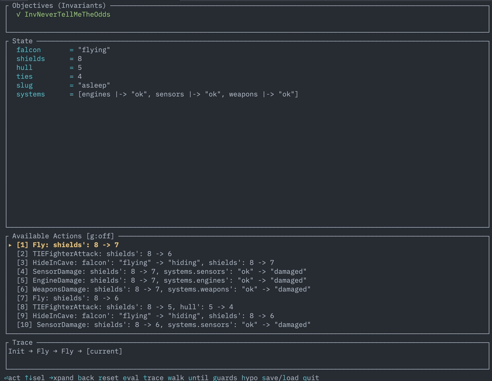

# tla-rs

A TLA+ model checker and interactive exploration tool written in Rust.

tla-rs verifies TLA+ specifications by exploring all reachable states, checking invariants, and reporting counterexamples. Beyond pass/fail checking, it provides an interactive TUI for stepping through state spaces, scenario-driven exploration, property satisfaction analytics with depth breakdowns, and parameter sweeps for sensitivity analysis. The core library compiles to WebAssembly, so it can be embedded in browser applications. It's designed as a lightweight alternative to the official TLC model checker for specs that fit its supported subset.

## Installation

```bash
cargo build --release
```

The binary will be at `target/release/tla`.

## Quick Start

```bash
tla spec.tla
tla spec.tla -c 'N=5' -c 'Procs={"p1","p2","p3"}'
tla spec.tla -c 'Proc={"a","b","c"}' --symmetry Proc
tla spec.tla --config model.cfg
tla spec.tla --quick    # limit to 10,000 states
tla spec.tla -i         # interactive TUI
```

Constants accept integers (`42`), booleans (`TRUE`), strings (`"hello"`), and sets (`{1,2,3}`).

## Options

| Option | Description |
|--------|-------------|
| `-c NAME=VALUE` | Set a constant value |
| `-s CONST` | Enable symmetry reduction for a constant |
| `--config PATH` | Load TLC-style cfg file (auto-discovers `Spec.cfg` next to `Spec.tla`) |
| `--max-states N` | Maximum states to explore (default: 1000000) |
| `--max-depth N` | Maximum trace depth (default: 100) |
| `-q` | Quick exploration (limit: 10,000 states) |
| `--export-dot FILE` | Export state graph to DOT format |
| `--allow-deadlock` | Allow states with no successors |
| `--check-liveness` | Check liveness and fairness properties |
| `--continue` | Continue past invariant violations |
| `--count-satisfying NAME` | Count states satisfying a definition (repeatable) |
| `--sweep NAME=V1;V2;...` | Sweep a constant across values, compare results |
| `--scenario TEXT` | Explore a specific scenario (or `@file`) |
| `-i` | Interactive TUI exploration mode |
| `--json` | JSON output |
| `-v` | Verbose output (depth breakdowns, etc.) |

## Configuration Files

tla-rs supports TLC-compatible `.cfg` files. If `Spec.cfg` exists next to `Spec.tla`, it is loaded automatically. Use `--config PATH` to specify an explicit path.

```
CONSTANT RM = {rm1, rm2, rm3}
INIT TPInit
NEXT TPNext
INVARIANT TPTypeOK
CHECK_DEADLOCK TRUE
```

Supported directives: `INIT`/`NEXT`, `SPECIFICATION` (temporal formula in `Init /\ [][Next]_vars` form), `CONSTANT`/`CONSTANTS`, `INVARIANT`/`INVARIANTS`, `PROPERTY`/`PROPERTIES`, `SYMMETRY`, and `CHECK_DEADLOCK`. CLI flags override cfg values.

## Scenarios

Drive the checker along specific execution paths using TLA+ expressions:

```bash
tla spec.tla --scenario "step: count' = count + 1
step: count' = count + 1
step: count' = count + 1"
```

Or load from a file with `--scenario @scenario.txt`. Each `step:` line is a TLA+ predicate over current (unprimed) and next (primed) state variables.

```
step: x' > x                    # x increases
step: "s1" \in active'          # s1 becomes active
step: pc'["p1"] = "critical"    # p1 enters critical section
```

## Analytics

These flags are for understanding *how* a protocol fails, not just *whether* it fails.

Without `--continue`, the checker stops at the first violation. With it, all violations are collected and counted per-invariant across the full state space:

```bash
tla spec.tla --allow-deadlock --continue
```

`--count-satisfying` measures what fraction of reachable states satisfy a predicate. Add `--verbose` to get per-depth breakdowns showing at which exploration depth violations start appearing:

```bash
tla spec.tla --allow-deadlock --continue \
  --count-satisfying InvSafety --verbose
```

`--sweep` varies a constant across multiple values and produces a comparison table, useful for sensitivity analysis:

```bash
tla spec.tla --sweep 'N=2;3;4;5' --count-satisfying Inv --allow-deadlock
```

`--json` returns structured data including `properties` array with `depth_breakdown` per property.

### The C-3PO Example

C-3PO famously calculates "the possibility of successfully navigating an asteroid field is approximately 3,720 to 1." The spec `examples/c3po_asteroid_field.tla` models the Empire Strikes Back asteroid chase: variable-damage asteroid impacts, TIE fighter attacks, TIEs getting destroyed by asteroids, hiding in the space slug's cave, mynock damage, escaping the exogorth's mouth, and the only real escape — attaching to a Star Destroyer's hull and floating away with the garbage. No hyperspace: the hyperdrive is dead.

The `Density` constant controls asteroid damage range (1..Density). Higher values create more damage variants per action, biasing the state space toward destruction.

```bash
tla examples/c3po_asteroid_field.tla -c 'Density=3' \
  --allow-deadlock --continue \
  --count-satisfying InvNeverTellMeTheOdds \
  --count-satisfying Escaped --verbose
```

The depth breakdown shows destruction starting early and escape requiring a long sequence of correct decisions — surviving asteroids, hiding in the cave, taking mynock damage, escaping the slug, then waiting for all TIE fighters to be destroyed before drifting onto a Star Destroyer's hull.

## Interactive Mode

Launch the TUI with `-i` to step through state spaces manually. You can select and take transitions, backtrack, evaluate expressions in a REPL, trace variable changes across history, test hypotheses against all visited states, and toggle guard condition display. Actions with many variable changes expand inline so you can see exactly what each transition does.



Key bindings: `↑`/`↓` select actions, `Enter` takes the selected action, `→`/`Space` expands grouped changes, `←` collapses, `b` backtracks, `e` opens the REPL, `t` shows variable trace, `h` tests a hypothesis, `g` toggles guards, `w` random walks N steps, `u` steps until a condition holds, `s`/`l` save/load traces, `r` resets to initial state, `q` quits.

```bash
tla examples/c3po_asteroid_field.tla -c 'Density=3' --allow-deadlock -i
```

## Supported TLA+ Subset

tla-rs implements the Naturals, Integers, Sequences, FiniteSets, TLC, Bags, and Bits standard modules. See `SYNTAX_STATUS.md` for the full operator-by-operator coverage table.

The supported operator categories: logic (`/\`, `\/`, `~`, `=>`), comparison, arithmetic, sets (`\in`, `\union`, `\intersect`, `SUBSET`, `UNION`), functions (`[x \in S |-> e]`, `DOMAIN`, `EXCEPT`, `@@`), quantifiers (`\E`, `\A`, `CHOOSE`), records, tuples/sequences, `IF-THEN-ELSE`, `CASE`, `LET-IN`, primed variables, `UNCHANGED`, transitive closure, module instances (`INSTANCE` with qualified calls), and Unicode equivalents for all operators.

### Module Instances

Specs can use `INSTANCE` to import and compose modules:

```tla
---- MODULE pingpong ----
LOCAL INSTANCE Naturals

VARIABLES server_to_client, client_to_server

Data == [message: {"ping"}] \cup [message: {"pong"}]

ServerToClientChannel(Id) == INSTANCE MChannel WITH channels <- server_to_client
ClientToServerChannel(Id) == INSTANCE MChannel WITH channels <- client_to_server

Next ==
    \/ \E id \in ClientIds: ServerToClientChannel(id)!Send([message |-> "ping"])
    \/ \E id \in ClientIds: ClientToServerChannel(id)!Recv([message |-> "pong"])
====
```

Both static (`Alias == INSTANCE M WITH ...`) and parameterized (`Alias(p) == INSTANCE M WITH ...`) instances are supported. Library modules without Init/Next work as expected. The module file must be in the same directory as the spec.

### Spec Structure

```tla
---- MODULE Example ----
EXTENDS Naturals

CONSTANT N
VARIABLES x, y

Init == x = 0 /\ y = 0

Next ==
    \/ (x < N /\ x' = x + 1 /\ y' = y)
    \/ (y < N /\ x' = x /\ y' = y + 1)

TypeOK == x \in 0..N /\ y \in 0..N
Inv == x + y <= 2 * N
====
```

Invariants are detected by naming convention: definitions starting with `Inv`, `TypeOK`, or `NotSolved` are automatically checked.

## Output

On success:
```
Model checking complete. No errors found.

  States explored: 1331
  Transitions: 3630
  Max depth: 31
  Time: 0.019s
```

On invariant violation, you get a counterexample trace with state diffs marking changed variables. On deadlock, a trace to the deadlock state with a suggestion to use `--allow-deadlock`. Parse errors show source locations, and undefined variables suggest similar names.

## State Graph Visualization

```bash
tla spec.tla --export-dot graph.dot
dot -Tpng graph.dot -o graph.png
```

Error states are highlighted in red.

## WebAssembly

The core library compiles to WASM for browser embedding:

```bash
cargo make wasm
```

This produces a `pkg/` directory with the WASM module and JS bindings. The WASM API provides `check_spec`, `check_spec_with_config`, `check_spec_with_cfg`, and `check_spec_with_options` — all returning JSON results with success status, state count, error traces, and optional DOT graph output.

## Limitations

`Nat` and `Int` are bounded (-100 to 100 by default). Temporal operators `[]`, `<>`, `~>` are parsed but cannot be evaluated directly — use `--check-liveness` for fairness/liveness properties via SCC analysis. Unbounded quantifiers (`\E x : P` without `\in S`) and `Seq(S)` enumeration are not supported. Recursive operators must be declared with `RECURSIVE`.

## License

MIT
